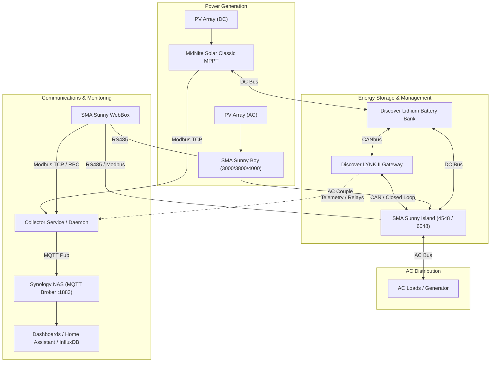

# Laughing Pig Solar Monitor

Centralized monitoring, telemetry, and data logging system for the **Laughing Pig** solar power generation, battery storage, and energy management installation.

---

## ☀️ System Overview

The Laughing Pig Solar Monitor is designed to aggregate real-time telemetry, track system health, and log historical performance across all power generation, storage, and conversion hardware on site.

The monitored setup is a robust hybrid / off-grid solar energy infrastructure featuring:
- **DC Solar Generation**: MidNite Solar Classic MPPT charge controller(s)
- **AC Solar Generation**: SMA Sunny Boy string inverter(s) (AC-coupled)
- **Battery Storage & Power Conditioning**: SMA Sunny Island 4548 / 6048 inverter-charger(s)
- **Energy Storage System (ESS)**: Discover Lithium battery bank managed via the Discover LYNK II gateway
- **Field Bus & Communications**: SMA Sunny WebBox (RS485), Modbus TCP/RTU, and CAN interfaces
- **Central Telemetry & Storage**: Synology NAS hosting an MQTT broker, containerized services, and long-term logging



---

## 🔌 Monitored Hardware & Communication Interfaces

| Component | Role | Network / IP Address | MAC Address & Hardware Info | Interface & Protocol |
| :--- | :--- | :--- | :--- | :--- |
| **SMA Sunny WebBox** | SMA Communications Gateway & Data Logger | `192.168.42.127` | `00:40:AD:29:16:70`<br>(SMA Regelsysteme GmbH) | • HTTP Web UI (Port 80)<br>• Modbus TCP (Port 502, Unit ID `1`)<br>• JSON-RPC API (`/rpc`)<br>• FTP (Port 21), Telnet (Port 23) |
| **SMA Sunny Island 6048-US** | Battery Inverter-Charger & System Master | Via WebBox (`192.168.42.127`) | Key: `SI6048UM:1260044199`<br>S/N: `1260044199` | • Modbus TCP via WebBox (Port 502, Unit ID `2`)<br>• Direct RS485 Field Bus |
| **SMA Sunny Boy 4000-US** | AC-coupled PV Inverter | Via WebBox (`192.168.42.127`) | Key: `WR40U08E:2000702586`<br>S/N: `2000702586`<br>(Type: `8007`) | • Modbus TCP via WebBox (Port 502, Unit ID `4`)<br>• RS485 Piggy-Back to WebBox |
| **Discover LYNK II** | Battery Management & Communications Gateway | `192.168.42.128` | `70:B3:D5:6F:17:A0`<br>(Discover Battery) | • Ethernet / LYNK Access & Cloud<br>• CANopen / SMA CAN to Sunny Island<br>• Programmable Relays |
| **MidNite Solar Classic** | DC-coupled MPPT Charge Controller | `192.168.42.129` | `60:1D:0F:00:11:32`<br>(Midnite Solar) | • Modbus TCP (Port 502, Unit ID `1`)<br>• Holding registers starting at `4115` |
| **Synology NAS** | Central Telemetry Hub & Storage | `192.168.42.184` | `90:09:D0:93:49:B8`<br>(Synology Incorporated) | • **MQTT Broker (Port 1883)**<br>• DSM 7.x Management (Ports 5000 / 5001)<br>• Web Station (Ports 80 / 443)<br>• SSH (Port 22) |


---

## 📁 Repository Structure

```text
Laughing Pig Solar Monitor/
├── config/
│   ├── config.yaml               # Modbus IPs, Unit IDs, poll intervals, MQTT settings
│   └── .env.example              # Environment variable overrides
├── src/
│   ├── __init__.py
│   ├── main.py                   # Application entrypoint & background scheduler
│   ├── config.py                 # Pydantic configuration loader
│   ├── modbus/
│   │   ├── __init__.py
│   │   ├── client.py             # Robust Modbus TCP connection manager
│   │   ├── classic.py            # MidNite Solar Classic register parser
│   │   └── sma.py                # SMA WebBox (Sunny Island & Sunny Boy) parser
│   ├── storage/
│   │   ├── __init__.py
│   │   ├── database.py           # SQLite time-series schema & query helpers
│   │   └── models.py             # Data models for snapshots & daily summaries
│   ├── mqtt/
│   │   ├── __init__.py
│   │   └── publisher.py          # MQTT publisher & Home Assistant Auto-Discovery
│   └── web/
│       ├── __init__.py
│       ├── app.py                # FastAPI server (API endpoints + static hosting)
│       ├── static/
│       │   ├── css/style.css     # Clean modern dark-mode responsive styling
│       │   └── js/dashboard.js   # Live power flow diagram, gauges, and charts
│       └── templates/
│           └── index.html        # Main dashboard page
├── data/                         # SQLite database storage (mounted in Docker)
├── Documentation/                 # Technical manuals, register maps, and utilities
│   ├── 10-001-1_REV-V_Classic_Manual21FEB2023.pdf
│   ├── classic_register_map_Rev-C5-December-8-2013.pdf
│   ├── SI4548-6048 Operating Manual-US-BE-en-21W.pdf
│   ├── SI-Modbus-BA-en-12.pdf
│   ├── SMA-Sunny-Boy-3000-3800-4000.pdf
│   ├── 485PB-SB-NR-IEN101311 System Monitoring Card.pdf
│   ├── SWebBox-BA-en-36.pdf
│   ├── Syno_UsersGuide_NAServer_7_4_enu.pdf
│   ├── WEBBOX-MODBUS-TB-en-19.pdf
│   ├── des-lynk-2-operating-manual.pdf
│   ├── des-lynk-2-relay-manual.pdf
│   ├── des-lynk-2-sma-manual.pdf
│   ├── 800-0010 (LYNK CANopen Interface Technical Reference Manual) - Rev D.pdf
│   ├── 860-0059-lynk-cloud-setup-guide.pdf
│   ├── LYNK 2.7.0 RC0 LYNK_app_only.bin
│   ├── LYNK2 Instruction to enter engineering mode.pdf
│   ├── LYNKAccessSetup_2.7.0.0_win64.exe
│   └── lynk-serial-can-interface-technical-reference.pdf
├── docker-compose.yml            # Synology Container Manager ready compose definition
├── Dockerfile                    # Lightweight Python 3.12 container definition
├── requirements.txt              # Minimal dependencies
└── README.md                     # Project documentation and architectural overview
```

---

## 🚀 Quick Start & Deployment

### Option A: Running on Synology NAS (Docker Compose)
1. **Copy Files to NAS**:
   Copy this repository directory (`Laughing Pig Solar Monitor`) to your Synology NAS, for example under `/volume1/docker/solar-monitor`.
2. **Launch with Synology Container Manager**:
   - Open **Container Manager** in DSM.
   - Go to **Project** -> **Create**.
   - Set Project Name: `laughing-pig-solar`.
   - Set Path: `/volume1/docker/solar-monitor`.
   - Select the `docker-compose.yml` file and click **Build and Start**.
3. **Alternatively via SSH**:
   ```bash
   cd /volume1/docker/solar-monitor
   docker compose up -d --build
   ```
4. **Access the Dashboard**:
   Open your browser to `http://192.168.42.184:8050`.

---

### Option B: Running Locally (Windows Workstation)
1. Install dependencies:
   ```powershell
   python -m pip install -r requirements.txt
   ```
2. Start the service:
   ```powershell
   python -m src.main
   ```
3. Open `http://localhost:8050` in your web browser.

---

## 📚 Technical Reference Library

All relevant hardware manuals and register definitions are indexed in the [`Documentation/`](Documentation/) directory:

### MidNite Solar
- **[Classic Charge Controller Manual](Documentation/10-001-1_REV-V_Classic_Manual21FEB2023.pdf)**: User manual and installation guide.
- **[Classic Register Map](Documentation/classic_register_map_Rev-C5-December-8-2013.pdf)**: Complete Modbus registers for querying telemetry over Ethernet or serial.

### SMA Solar Technology
- **[Sunny Island 4548 / 6048 Operating Manual](Documentation/SI4548-6048%20Operating%20Manual-US-BE-en-21W.pdf)**: Operation and wiring guide.
- **[Sunny Island Modbus Technical Description](Documentation/SI-Modbus-BA-en-12.pdf)**: Modbus profile, data types, and register addresses for Sunny Island.
- **[Sunny Boy 3000 / 3800 / 4000 Manual](Documentation/SMA-Sunny-Boy-3000-3800-4000.pdf)**: PV inverter operational specifications.
- **[Sunny Boy RS485 Communication Card](Documentation/485PB-SB-NR-IEN101311%20System%20Monitoring%20Card.pdf)**: Piggy-back card wiring and configuration.
- **[Sunny WebBox Operating Manual](Documentation/SWebBox-BA-en-36.pdf)**: WebBox interface, network setup, and logging configuration.
- **[Sunny WebBox Modbus Guide](Documentation/WEBBOX-MODBUS-TB-en-19.pdf)**: Polling SMA devices through the WebBox Modbus gateway.

### Discover Battery & LYNK II Gateway
- **[Discover LYNK II Operating Manual](Documentation/des-lynk-2-operating-manual.pdf)**: Overview, hardware ports, and operational setup.
- **[Discover LYNK II SMA Integration Manual](Documentation/des-lynk-2-sma-manual.pdf)**: Closed-loop CAN integration between Discover batteries and SMA Sunny Island.
- **[Discover LYNK II Relay Manual](Documentation/des-lynk-2-relay-manual.pdf)**: Programmable relay configuration for load shedding and generator start/stop.
- **[LYNK CANopen Interface Technical Reference](Documentation/800-0010%20(LYNK%20CANopen%20Interface%20Technical%20Reference%20Manual)%20-%20Rev%20D.pdf)**: CANopen object dictionary and protocol details.
- **[LYNK Serial CAN Technical Reference](Documentation/lynk-serial-can-interface-technical-reference.pdf)**: Serial-to-CAN messaging specifications.
- **[LYNK Cloud Setup Guide](Documentation/860-0059-lynk-cloud-setup-guide.pdf)**: Cloud connection and remote monitoring setup.

### Synology NAS & Infrastructure
- **[Synology NAS User's Guide (DSM 7.x)](Documentation/Syno_UsersGuide_NAServer_7_4_enu.pdf)**: Administration, package management, container deployment, and storage configuration.
